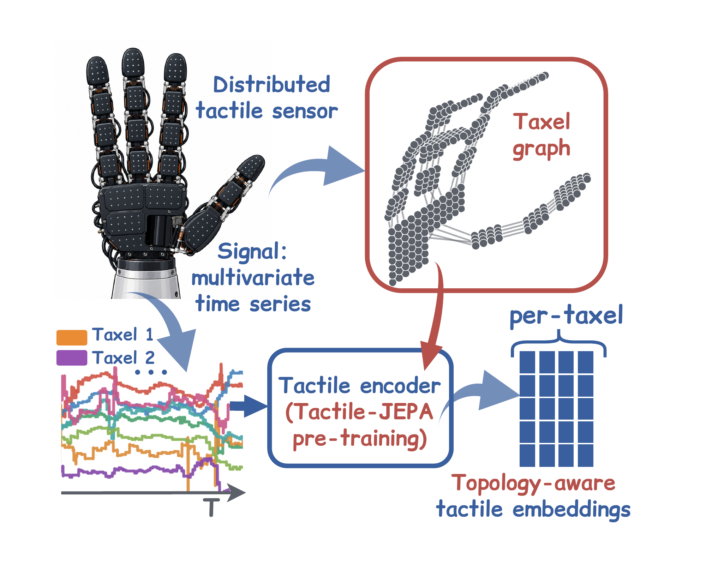
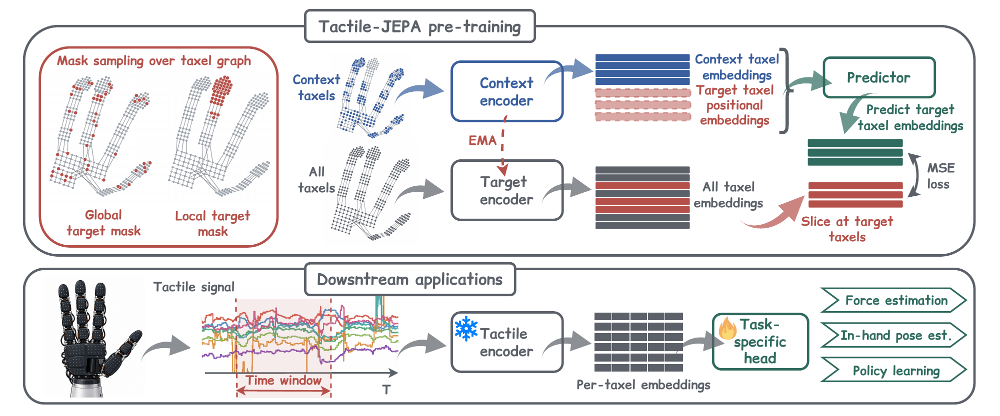

# Tactile-JEPA

**Topology-aware self-supervised learning for distributed tactile sensors.**

Code accompanying the Tactile-JEPA paper. Tactile-JEPA learns reusable representations directly from the multivariate time series produced by electronic skins. It predicts masked taxel embeddings using local and global masks sampled over the sensor connectivity graph.

| Resource | Link |
| --- | --- |
| Paper / arXiv | TODO: add link |
| Pretrained models | TODO: add link |
| Datasets and download instructions | TODO: add links |

<p align="center">
  
</p>

## Overview

Tactile-JEPA combines three components: a context encoder, an exponential-moving-average (EMA) target encoder, and a predictor. The predictor infers hidden taxel embeddings from visible context; training minimizes the mean squared error against the target encoder outputs. The pretrained target encoder is then frozen and reused with task-specific heads.

- **Topology-aware masking:** targets follow the connectivity of the sensing surface rather than an image grid.
- **Multi-scale targets:** the default target mixture uses two local and two global masks to capture contact patterns at different scales.
- **Multiple sensor types and embodiments:** evaluation covers magnetic hand skins, piezoresistive tactile socks, and bimanual tactile hands.
- **Reusable representations:** downstream tasks include force estimation, in-hand and full-body pose estimation, object and action classification, and visuo-tactile policy learning.

<p align="center">
  
</p>

The paper uses a ViT-Tiny encoder (12 blocks, 192-dimensional embeddings, 3 attention heads) and a 4-block predictor. The taxel graph is used for mask sampling during pretraining; downstream encoding does not require the graph.

## Installation

Requirements: Linux, Conda, and an NVIDIA GPU with a CUDA-compatible driver.

From the repository root, create the environment and install the package:

```bash
PIP_EXTRA_INDEX_URL=https://download.pytorch.org/whl/cu126 \
  conda env create -f tactile_environment.yml
conda activate conda_tactile_env
python -m pip install -e .
```

## Datasets

The paper evaluates three existing datasets:

| Dataset | Sensor / embodiment | Taxels | Channels per taxel | Sampling rate | Frames per window | Downstream tasks |
| --- | --- | --- | --- | --- | --- | --- |
| Sparsh-skin | Xela uSkin / Allegro hand | 368 | 3 | 100 Hz | 10 | Force, in-hand pose, object classification |
| Tactile socks | Knitted pressure sensors / human feet | 237 + 216 | 1 | 14 Hz | 5 | Action classification, full-body pose |
| DECO-50 | Inspire FTP / two Inspire hands | 1062 per hand | 1 | 30 Hz | 3 | Visuo-tactile policy learning |

**Downloads:** TODO: add dataset links and release-specific preparation instructions.

### Data preparation

Run all commands from the repository root. Unpack the datasets into the following layout (only the required directories are shown):

```text
datasets/
  sparsh-skin/
    xela/pretraining/extracted/
      baseline/xela/data.pkl
      urdf/ahrcpcpn.urdf
      <object>/<recording>/...
    downstream_tasks/
      force_estimation/...
      relative_pose_estimation/...
  socks/
    data_classification/sock_classification/<recordings>/...
    tactile2pose/dataset/{train,val,test}.p
  deco50/task4/
    data-t4-1/episode_*.tar[.gz]
    ...
    data-t4-6/episode_*.tar[.gz]
```

- **Xela:** include downstream labels, baseline measurements, and the URDF. The loaders build `cache/xela/` automatically on first use; the first launch takes longer.
- **Tactile socks:** no separate cache step. Pose requires the prepared `train.p`, `val.p`, and `test.p` arrays from the dataset release; raw motion-capture files alone are insufficient. Sensor geometry is included in `assets/socks/`.
- **DECO:** keep the Assembly episode archives for all six variants. Both `.tar` and `.tar.gz` work; `.tar` is faster for random access. Prepare the caches needed by your experiment once:

```bash
# JEPA pretraining: episode index; training reads the archives directly
python scripts/prepare_data.py deco --stage manifest

# Cached SSL baselines such as MAE: normalized tactile windows
python scripts/prepare_data.py deco --stage pretrain

# Policy learning: tactile/image/action shards and frozen visual features
python scripts/prepare_data.py deco --stage policy
```

DECO artifacts are stored in `cache/deco/` and reused across runs. The tactile cache does not require decoding images. Policy preparation needs additional disk space for image shards and automatically downloads ImageNet ResNet18 weights on first use; add `--device cpu` to extract features without a GPU. Use `--stage all` to prepare everything.

Defaults are set in `config/paper/common.yaml`. For data stored elsewhere, pass `paths.xela=...`, `paths.socks=...`, or `paths.deco=...` to training. For DECO, use matching data and cache paths during preparation and training:

```bash
python scripts/prepare_data.py deco --stage all --root /data/deco/task4 --cache /data/cache/deco
python train.py --config-path config/paper --config-name deco/pretrain/jepa paths.deco=/data/deco/task4 paths.deco_cache=/data/cache/deco
```

## Training

Configurations are organized by dataset, task, and method under `config/paper/`. List the available presets or inspect a configuration without training:

```bash
find config/paper/{xela,socks,deco} -name "*.yaml" | sort
python train.py --config-path config/paper --config-name xela/pretrain/jepa --cfg job
```

### Self-supervised pretraining

```bash
python train.py --config-path config/paper --config-name xela/pretrain/jepa
python train.py --config-path config/paper --config-name socks/action/pretrain/jepa
python train.py --config-path config/paper --config-name socks/pose/pretrain/jepa
python train.py --config-path config/paper --config-name deco/pretrain/jepa
```

### Downstream tasks

Sparsh-skin uses the force, object, and pose entrypoints; Socks has separate action and pose entrypoints, and DECO uses its policy entrypoint. Set `checkpoint` to the matching pretrained encoder:

```bash
python train_task_force.py --config-path config/paper --config-name xela/force/jepa checkpoint=/path/to/xela.ckpt
python train_task_object.py --config-path config/paper --config-name xela/object/jepa checkpoint=/path/to/xela.ckpt
python train_task_pose_estimation.py --config-path config/paper --config-name xela/pose/jepa checkpoint=/path/to/xela.ckpt
python train_task_socks_action.py --config-path config/paper --config-name socks/action/downstream/jepa checkpoint=/path/to/socks-action.ckpt
python train_task_socks_pose.py --config-path config/paper --config-name socks/pose/downstream/jepa checkpoint=/path/to/socks-pose.ckpt
python train_task_deco_policy.py --config-path config/paper --config-name deco/policy/jepa checkpoint=/path/to/deco.ckpt
```

Outputs, checkpoints, and evaluation artifacts are written under `outputs/` in a separate directory for each run; override it with `paths.logs=...`. DECO policy presets train directly for 150 epochs with one learning-rate schedule.

### Baselines and ablations

Presets include `dino`, `mae`, `byol`, and `e2e`, plus `local`, `global`, `local_context`, and `ijepa` masking variants. For example:

```bash
python train.py --config-path config/paper --config-name xela/pretrain/dino
python train.py --config-path config/paper --config-name xela/pretrain/local
python train.py --config-path config/paper --config-name deco/pretrain/ijepa
```

`local` and `global` use single-scale targets; `local_context` uses connected context; `ijepa` uses rectangular masks. To evaluate an ablation, pass its encoder checkpoint to the matching JEPA downstream preset. `e2e` trains from scratch and does not need a pretrained checkpoint. Available methods vary by task; the configuration filenames show the supported combinations.

## Evaluation protocol

The paper evaluates frozen encoders with task-specific heads and reports means and sample standard deviations across independent runs:

- Pretraining seeds: `42`, `17`, `3407`, selected with `seed=...`.
- Downstream seeds per encoder: `42`, `17`, `3407` on Sparsh-skin (9 runs per task); additionally `1` on Tactile socks and DECO-50 (12 runs per task).
- For each downstream run, set `checkpoint` to that encoder and `pretrain_seed` to its pretraining seed; `seed` selects the head seed. Keep `data_seed=42` fixed.

Tactile socks encoders are pretrained separately on each task's training subset. DECO-50 shares training demonstrations between encoder pretraining and policy learning, with validation and test demonstrations held out. Force and in-hand pose data are separate from the Sparsh-skin pretraining data. Keep the exact split and preprocessing protocol fixed when comparing methods.

## Repository structure

```text
config/paper/            Public experiment presets and common paths
  xela/                 Pretraining, force, object, and pose tasks
  socks/                Action and pose experiments
  deco/                 Pretraining and policy learning
  components/           Shared data, encoder, and head configurations
tactile_ssl/            Data loaders, encoders, objectives, task heads, and trainer
train.py                Self-supervised pretraining
train_task_*.py          Downstream training and evaluation
scripts/prepare_data.py Prepare DECO manifests and caches
assets/                 README figures and Socks sensor geometry
```

## Citation

**TODO: add the Tactile-JEPA BibTeX entry and arXiv link when available.**

## Acknowledgements

This codebase builds on [Sparsh / Sparsh-X / Sparsh-Skin](https://github.com/facebookresearch/sparsh-multisensory-touch). The experiments also adapt baselines from [Tactile Dexterity (T-DEX)](https://github.com/irmakguzey/tactile-dexterity) and [SensTextile](https://github.com/YunzhuLi/senstextile). We thank the authors for releasing their code and datasets. Please also cite the original methods and datasets when using them.

## License

See [LICENSE.md](LICENSE.md) for the repository license. Refer to the original releases for the terms governing third-party datasets and assets.
